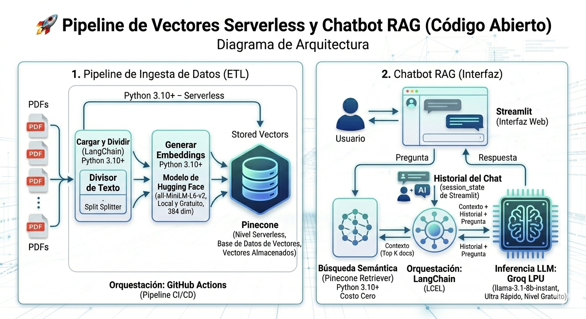

# 🚀 Serverless Vector Pipeline & RAG Chatbot (Open Source)

Este proyecto implementa una solución integral de Retrieval-Augmented Generation (RAG). Permite convertir documentos no estructurados (PDFs) en vectores de alta dimensionalidad y consultarlos mediante un Chatbot inteligente con respuesta en milisegundos.

Enfoque: Freelance / Cost-Zero. Arquitectura diseñada para ejecutarse íntegramente en capas gratuitas (Free-Tiers) de servicios Cloud de alto rendimiento.

# 🛠️ Arquitectura del Sistema
El proyecto se divide en dos componentes críticos:

1. Data Ingestion Pipeline (ETL)
Orquestación: GitHub Actions (CI/CD Pipeline).

Procesamiento: Python 3.10+ con LangChain.

Embeddings: Hugging Face (all-MiniLM-L6-v2) operando de forma local/serverless.

Vector Database: Pinecone (Serverless Tier).

2. RAG Chatbot (Interface)
Framework: Streamlit para una interfaz web ligera.

Inferencia LLM: Groq LPU (modelo llama-3.1-8b-instant), garantizando respuestas casi instantáneas.

Lógica de Cadena: LangChain Expression Language (LCEL) para máxima estabilidad y modularidad.

Diagrama: 

# 📦 Instalación Local
Clonar el repositorio:

Bash
git clone 
cd nombre-repo
Entorno Virtual:

Bash
python -m venv venv
 Activar en Windows:

.\venv\Scripts\activate

Activar en Unix/macOS:

source venv/bin/activate
Instalar Dependencias:

Bash
pip install -r requirements.txt
Configurar Variables de Entorno:
Crea un archivo .env en la raíz con:

Fragmento de código
GROQ_API_KEY=tu_api_key
PINECONE_API_KEY=tu_api_key
PINECONE_INDEX_NAME=tu_nombre_de_indice

# 🚀 Uso
Para Ingestar Datos: Simplemente sube tus archivos .pdf a la carpeta /data y realiza un push a GitHub. Actions se encargará de vectorizarlos.

Para Consultar (Chatbot): Ejecuta el dashboard localmente:

Bash
streamlit run app.py

# 📄 Licencia
Este proyecto es Open Source bajo la licencia MIT.